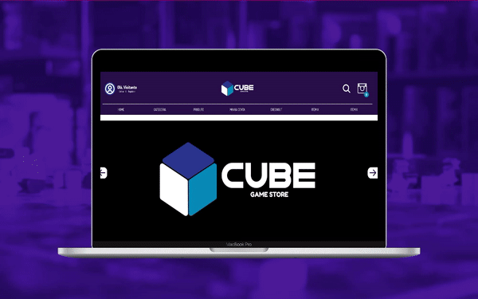

<div align="center" id="top">
  
[🇧🇷 Português](./README.md) | [🇺🇸 English](./README_EN.md) | [🇪🇸 Español](./README_ES.md)

</div>

# Cube Game Store

<div align="center">


[View Demo](https://www.figma.com/file/kkD6M2EYo7oGMDToHGNUXs/CUBE-Game-Store---Layout-Padronizado?node-id=14%3A63)


</div>

<p align="center">
  <a href="#-about-the-project">About the Project</a> &#xa0; | &#xa0;
  <a href="#-technologies">Technologies</a> &#xa0; | &#xa0;
  <a href="#-installation-and-use">Installation and Use</a> &#xa0; | &#xa0;
  <a href="#-steps">Steps</a> &#xa0; | &#xa0;
  <a href="#-team">Team</a> &#xa0; | &#xa0;
  <a href="#-license">License</a> &#xa0; | &#xa0;
  <a href="#-contact">Contact</a> &#xa0;
</p>

## 🎯 About the Project

**Cube Game Store** is a project developed by group 4 during the Fullstack Web Development course (Digital House). As an integrative project, we were tasked to develop an e-commerce platform with a free theme. The group chose to create an e-commerce for board games.

<div align="center">

</div>

The project encompasses from the creation of visual identity to finalization and deployment.

## 🚀 Technologies

- HTML5
- CSS3
- EJS
- [NodeJs](https://nodejs.org/en/)
- [React.js](https://reactjs.org/)
- [Next.js](https://nextjs.org/)
- [Express Js](https://expressjs.com/)
- [MySQL](https://www.mysql.com)
- [Sequelize ORM](https://sequelize.org)

## 🏁 Installation and Use

```bash
# Clone this repository
git clone https://github.com/thiilins/cube-game-store

# Go into the folder
cd cube-game-store

# Install the dependencies
npm install

# Start the project
npm start

# The app will initialize on <http://localhost:3000>

# Admin User (For testing purposes)
# User: admin@admin.com.br
# Password: 123456
```
## ✨ Steps

- [x] Designing the pages' layout in Figma
- [x] Creating Pages in HTML/CSS
- [x] Setting up the NodeJs server
- [x] Initial route creations
- [x] Convert the pages to EJS
- [x] Creation of DER and Database
- [ ] Configuration of Sequelize ORM
- [ ] Setting up the Admin Panel

## ✔️ Team

- [@thiilins](https://github.com/thiilins)
- [@benehurp](https://github.com/benehurp)
- [@ruancorreia](https://github.com/ruancorreia)
- [@lSodre01](https://github.com/lSodre01)
- [@thomazszy](https://github.com/thomazszy)

## 📝 License

This project is under the MIT License. Check the file [LICENSE](./LICENSE) for more details.

## 📞 Contact

For suggestions, feedback, or inquiries, open an [issue](https://github.com/thiilins/cube-game-store/issues) or get in touch through [my GitHub profile](https://github.com/thiilins).

<p align="right">(<a href="#top">Back to top</a>)</p>
