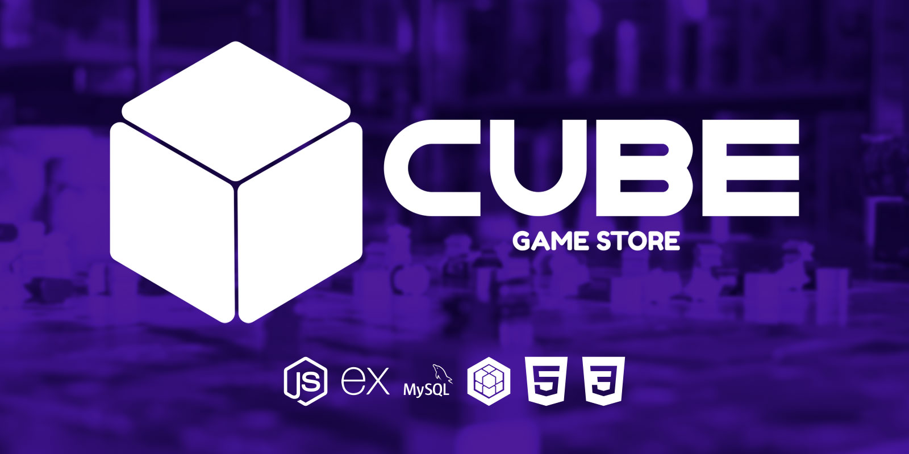

<div align="center" id="top">

[🇧🇷 Português](./README.md) | [🇺🇸 English](./README_EN.md) | [🇪🇸 Español](./README_ES.md)

</div>

# Cube Game Store

<div align="center">



[Ver Demostración](https://www.figma.com/file/kkD6M2EYo7oGMDToHGNUXs/CUBE-Game-Store---Layout-Padronizado?node-id=14%3A63)


</div>

<p align="center">
  <a href="#-acerca-del-proyecto">Acerca del Proyecto</a> &#xa0; | &#xa0;
  <a href="#-tecnologías">Tecnologías</a> &#xa0; | &#xa0;
  <a href="#-instalación-y-uso">Instalación y Uso</a> &#xa0; | &#xa0;
  <a href="#-etapas">Etapas</a> &#xa0; | &#xa0;
  <a href="#-equipo">Equipo</a> &#xa0; | &#xa0;
  <a href="#-licencia">Licencia</a> &#xa0; | &#xa0;
  <a href="#-contacto">Contacto</a> &#xa0;
</p>

## 🎯 Acerca del Proyecto

**Cube Game Store** es un proyecto desarrollado por el grupo 4 durante el curso de Desarrollo Web Fullstack (Digital House). Como proyecto integrador, se nos asignó desarrollar una plataforma de comercio electrónico con un tema libre. El grupo eligió crear un comercio electrónico de juegos de mesa.

<div align="center">

</div>

El proyecto abarca desde la creación de la identidad visual hasta la finalización y despliegue.

## 🚀 Tecnologías

- HTML5
- CSS3
- EJS
- [NodeJs](https://nodejs.org/en/)
- [React.js](https://reactjs.org/)
- [Next.js](https://nextjs.org/)
- [Express Js](https://expressjs.com/)
- [MySQL](https://www.mysql.com)
- [Sequelize ORM](https://sequelize.org)

## 🏁 Instalación y Uso

```bash
# Clonar este repositorio
git clone https://github.com/thiilins/cube-game-store

# Entrar en la carpeta
cd cube-game-store

# Instalar las dependencias
npm install

# Iniciar el proyecto
npm start

# La aplicación se inicializará en <http://localhost:3000>

# Usuario Administrador (Para fines de prueba)
# Usuario: admin@admin.com.br
# Contraseña: 123456
```

## ✨ Etapas

- [x] Diseño del layout de las páginas en Figma
- [x] Creación de Páginas en HTML/CSS
- [x] Configuración del servidor NodeJs
- [x] Creación de rutas iniciales
- [x] Convertir las páginas a EJS
- [x] Creación de DER y Base de Datos
- [ ] Configuración de Sequelize ORM
- [ ] Configuración del Panel de Administración

## ✔️ Equipo

- [@thiilins](https://github.com/thiilins)
- [@benehurp](https://github.com/benehurp)
- [@ruancorreia](https://github.com/ruancorreia)
- [@lSodre01](https://github.com/lSodre01)
- [@thomazszy](https://github.com/thomazszy)

## 📝 Licencia

Este proyecto está bajo la licencia MIT. Consulte el archivo [LICENCIA](./LICENSE) para obtener más detalles.

## 📞 Contacto

Para sugerencias, comentarios o consultas, abre un [issue](https://github.com/thiilins/cube-game-store/issues) o contacta a través de [mi perfil de GitHub](https://github.com/thiilins).

<p align="right">(<a href="#top">Volver al principio</a>)</p>
